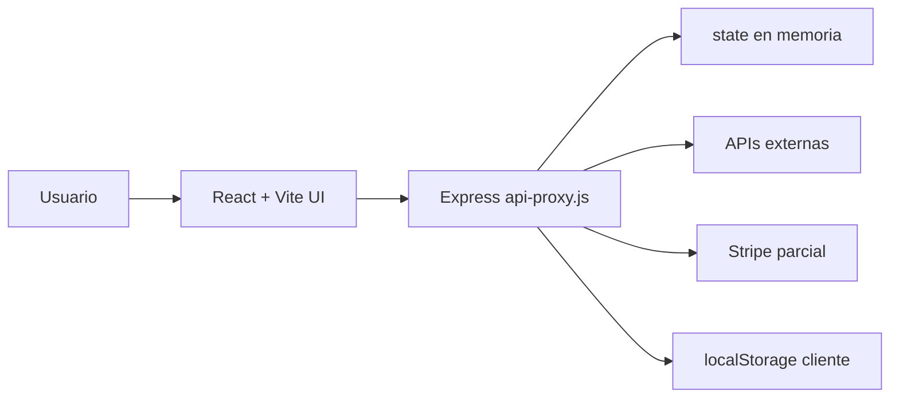

# SYSTEM-FLOW-CURRENT.md

Fecha: 2026-07-12  
Proyecto: Sweet Little Trauma Studio  
Documento: Historico, diagnostico inicial y recorridos rotos antes de la reparacion por fases.

## 1. Proposito

Este documento describe como funcionaba realmente el sistema antes de las reparaciones de las fases 1 a 11. La fuente principal es `AUDIT-SLT-STUDIO.md`, reforzada con los hallazgos resueltos y documentados en `REPAIR-LOG.md`.

La plataforma ya tenia una interfaz avanzada y un backend unico en `server/api-proxy.js`, pero la mayoria de los flujos criticos estaban mezclados entre prototipo local, providers parcialmente conectados, estado en memoria y controles visuales sin contrato real.

## 2. Arquitectura inicial observada

## 3. Flujo comun inicial de generacion

Recorrido esperado:

Usuario -> interfaz creativa -> boton Generate -> `/api/generate/:kind` -> validacion -> proveedor externo -> resultado -> historial/proyecto -> UI.

Recorrido real antes de la intervencion:

1. El frontend armaba un payload desde cada estudio.
2. `src/lib/api-client.js` enviaba requests al backend.
3. El backend aceptaba identidad por header o usuario demo.
4. `handleGenerate(kind)` resolvia plan, creditos y proveedor.
5. Muchos providers se consideraban "connected" solo por presencia de env vars.
6. Jobs largos podian quedar en espera o requerir polling parcial.
7. El resultado se guardaba en `state.history` y `state.projects`, ambos en memoria.
8. Algunos resultados usaban URLs temporales o placeholders.

Corte principal: no habia una separacion limpia entre autorizacion, reserva financiera, ejecucion larga, almacenamiento persistente y entrega final.

## 4. Recorridos por modulo antes de reparar

### 4.1 Home / asistente inicial

Flujo real:

Usuario -> Home -> clasificador local de intencion -> ruta sugerida o `/api/assist` -> respuesta corta.

Problemas:

- No era un agente conversacional completo.
- La seleccion de accion existia, pero no siempre se convertia en un flujo guiado de produccion.
- Algunas opciones llevaban a modulos que visualmente existian pero no tenian backend real.

### 4.2 Image Studio

Flujo real:

Usuario -> `ImageStudio.jsx` -> provider visual -> `/api/generate/image` -> `runProviderGateway` -> provider -> resultado.

Problemas:

- La UI mostraba proveedores no mapeados realmente en backend como si estuvieran disponibles.
- Algunas herramientas eran labels de producto, no pipelines separados.
- Replicate/FLUX podia requerir procesamiento async, pero la relacion job -> webhook -> storage no estaba completa al inicio.
- El costo era fijo por tipo (`image: 10`) y no por proveedor/modelo.

### 4.3 Video Studio

Flujo real:

Usuario -> `VideoStudio.jsx` -> herramienta video -> `/api/generate/video` -> provider directo o plan timeline -> job/polling parcial.

Problemas:

- Los procesos largos se trataban de forma demasiado sincronica o parcial.
- Polling estaba limitado a providers directos especificos.
- No habia una maquina general de estados para todos los providers largos.
- Long-form devolvia plan/timeline, no render final largo.
- El costo era fijo (`video: 300`), no por segundos/modelo.
- Si el provider devolvia URL temporal, el historial podia quedar apuntando a un asset que expiraba.

### 4.4 Music Studio

Flujo real:

Usuario -> `MusicStudio.jsx` -> lista visual de providers -> `/api/generate/music`.

Problemas:

- El provider estaba hardcodeado a Suno aunque la pantalla mostraba otras opciones.
- Suno estaba preparado, pero sin endpoint/API oficial directa estable en este backend.
- La UI sugeria capacidad de produccion musical completa aunque algunos providers no estaban ejecutables.
- El costo era fijo (`music: 150`), no por track/proveedor.

### 4.5 Sound / Voice Studio

Flujo real:

Usuario -> `SoundStudio.jsx` -> `/api/generate/sound` -> ElevenLabs por defecto.

Problemas:

- El provider estaba hardcodeado a ElevenLabs aunque se listaban otros.
- No se diferenciaba TTS sincronico de audio/FX potencialmente asincrono.
- El costo era fijo (`sound: 25`), no por caracteres.
- Import/Play eran controles visuales sin flujo completo.

### 4.6 Fashion Studio

Flujo real:

Usuario -> `FashionStudio.jsx` -> prompt/look -> generacion de imagen generica o guardado mock.

Problemas:

- El modulo vendia Fashion como pipeline propio, pero usaba generacion de imagen general.
- No habia workflow real de apparel, virtual try-on, textile generation ni licenciamiento.
- El boton de generacion podia producir algo, pero no garantizaba el producto Fashion prometido.

### 4.7 Engineering Lab / Apps / Games

Flujo real:

Usuario -> `EngineeringLab.jsx` -> tool/action visual -> `handleExecute`.

Problemas:

- `handleExecute` no ejecutaba ninguna accion real.
- Las tarjetas de App Library, Game Library, Automation y Custom App Request eran fachada.
- No existia endpoint de request, brief, cola de entrega ni persistencia de proyectos de software.

### 4.8 Projects / History

Flujo real:

Usuario -> frontend -> `/api/projects` o `/api/history` -> arrays en memoria.

Problemas:

- Los datos se perdian al reiniciar el proceso Node.
- Parte del estado tambien podia duplicarse en `localStorage`.
- No habia aislamiento durable por tenant ni auditoria persistente.

### 4.9 Billing / Subscription / Credits

Flujo real:

Usuario -> checkout/portal -> Stripe parcial -> estado local en memoria.

Problemas:

- Stripe podia crear sesiones, pero el estado comercial no era durable.
- El saldo se trataba como balance mutable, no como ledger.
- No habia reserva/captura/liberacion: una generacion fallida podia dejar inconsistencias.
- Webhooks de pago necesitaban idempotencia fuerte.

### 4.10 Seguridad

Flujo real:

Cliente -> headers/localStorage -> backend aceptaba identidad de desarrollo.

Problemas:

- Auth mock permitia operar endpoints sensibles.
- `x-slt-user-id` era una fuente peligrosa de identidad.
- CORS estaba abierto.
- No habia rate limit diferenciado.
- No habia aislamiento real por tenant en DB porque no habia DB.
- Webhooks necesitaban validacion criptografica e idempotencia.

## 5. Fallas transversales diagnosticadas

1. Auth de desarrollo mezclada con operaciones reales.
2. Estado critico en memoria: usuarios, billing, creditos, proyectos, historial, jobs.
3. Providers declarados como conectados por env vars, no por health real.
4. Falta de fallback estandarizado.
5. Inferencia larga parcialmente sincronica.
6. Sin ledger transaccional.
7. Sin moderacion previa antes de gastar creditos.
8. URLs temporales de providers sin aseguramiento sistematico.
9. UI con modulos comerciales mock no bloqueados.
10. Tests insuficientes para flujos financieros, seguridad y webhooks.

## 6. Estado inicial resumido

La plataforma era un prototipo avanzado con una vision de producto clara y varias conexiones tecnicas reales, pero todavia no tenia una arquitectura de produccion cerrada. El mayor riesgo era vender o exponer generacion real sobre una base de auth/creditos/proyectos en memoria y con modulos visuales que no siempre tenian una ruta ejecutable real.

