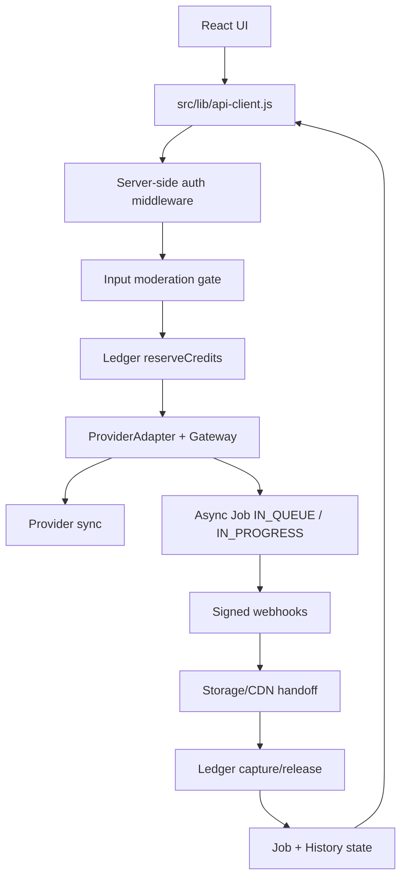

# SYSTEM-FLOW-TARGET.md

Fecha: 2026-07-12  
Proyecto: Sweet Little Trauma Studio  
Documento: Arquitectura objetivo construida y estado final despues de las fases 1 a 11.

## 1. Proposito

Este documento describe la arquitectura real que quedo implementada en el repositorio. No inventa servicios externos no presentes: la plataforma sigue siendo una app React + Vite con backend Express en `server/api-proxy.js`, estado local/in-memory para esta version y storage local/CDN configurable. Sobre esa base se implementaron patrones profesionales para gateway, jobs, ledger, moderacion, almacenamiento, pagos, seguridad, tests y bloqueo de modulos incompletos.

## 2. Arquitectura objetivo actual

## 3. Componentes construidos

### 3.1 ProviderAdapter & Gateway

Archivos principales:

- `server/api-proxy.js`
- `src/pages/ImageStudio.jsx`
- `src/pages/VideoStudio.jsx`
- `src/pages/MusicStudio.jsx`
- `src/pages/SoundStudio.jsx`

Responsabilidad:

- Normalizar providers por nombre.
- Determinar estado del proveedor sin exponer secretos.
- Ejecutar adapters por tipo.
- Enrutar fallback si un proveedor falla o no esta disponible.
- Exponer metadata segura: modelo, pricing, ejecucion sync/async y soporte de webhook.

Flujo:

Usuario -> UI creativa -> `generateStudio()` -> `/api/generate/:kind` -> `providerStatus()` -> `runProviderGateway()` -> `ProviderAdapter.generate()` -> adapter especifico.

Estado final:

- Imagen: OpenAI Images, Gemini Image, Grok Image, FLUX/Replicate, Stability, Ideogram, Recraft, Leonardo.
- Video: Seedance, Runway, Veo, Kling, Luma, PixVerse, OmniHuman, Hailuo, Wan, HeyGen, D-ID.
- Musica: SLT Composer, MiniMax Music, Stable Audio, Suno preparado, Udio preparado, ElevenLabs Music preparado.
- Voz/Sound: ElevenLabs, OpenAI Audio, MiniMax Speech, Stability Audio, Moises; Dolby/iZotope preparados o pausados.
- 3D: Meshy y Tripo3D preparados en catalogo.

### 3.2 Motor asincrono

Archivos principales:

- `server/api-proxy.js`
- `src/hooks/useStudioGenerate.js`
- `src/lib/api-client.js`
- `tests/core-flows.test.js`

Estados:

- `IN_QUEUE`
- `IN_PROGRESS`
- `COMPLETED`
- `FAILED`

Flujo:

1. El frontend hace POST a `/api/generate/video`, `/api/generate/music` o un provider async de imagen.
2. El backend crea un Job local.
3. El backend devuelve HTTP 202 con `jobId`.
4. El frontend inicia polling con `pollJob()`.
5. Webhooks firmados o polling de provider actualizan el Job.
6. La UI muestra progreso, error o asset final.

Limitacion real:

- No hay Redis ni cola externa. La cola vive en memoria dentro del proceso Node.
- Para produccion multi-instancia se debe migrar Jobs/Ledger/Assets a DB durable.

### 3.3 Webhooks firmados e idempotencia

Endpoints:

- `/api/webhooks/fal`
- `/api/webhooks/replicate`
- `/api/stripe/webhook`
- `/api/webhooks/stripe`

Responsabilidad:

- Verificar firma HMAC o `Stripe-Signature`.
- Evitar replay attacks con timestamp/tolerancia cuando aplica.
- Registrar eventos procesados.
- Ignorar duplicados ya completados o fallidos.
- Resolver jobs y ledger una sola vez.

### 3.4 Ledger transaccional

Funciones:

- `reserveCredits()`
- `resolveReservation()`
- `ledgerSnapshot()`
- `creditCostFor()`

Modelo implementado:

1. Pre-flight: calcular costo por kind/proveedor/payload.
2. Reserve: mover creditos disponibles a retenidos.
3. Capture: si el job termina OK, cobrar definitivamente.
4. Release: si falla, devolver creditos exactos.
5. Idempotencia: operaciones protegidas por `idempotencyKey`.

Costos actuales:

- Video: por segundos segun provider/modelo.
- ElevenLabs voz: por caracteres.
- Musica: por track/unidad.
- 3D: por asset/unidad preparada.
- CEO mode: costo cero, manteniendo `originalCost` para auditoria.

Limitacion real:

- El ledger es in-memory. El patron esta implementado, pero debe persistirse en DB transaccional antes de produccion publica.

### 3.5 Moderacion multicapa

Funciones:

- `runInputModeration()`
- `moderationFailurePayload()`
- Output review flags en completado de assets.

Flujo:

Usuario -> prompt -> Input Gate -> si bloqueado HTTP 400 -> no se reserva credito -> no se crea job -> no se llama provider.

Estado final:

- El input gate corre antes de `reserveCredits`.
- Tests validan que un prompt toxico no mueve ledger.
- Output gate marca revision superficial para asset generado.

### 3.6 Almacenamiento y CDN

Funciones/zonas:

- `storagePublicBaseUrl()`
- `completeAsyncJob()`
- `handleProviderWebhook()`
- storage local bajo `SLT_STORAGE_DIR` o directorio temporal segun entorno.

Flujo:

Provider -> URL temporal -> backend descarga/copia asset -> storage propio/local -> URL `/cdn/assets/...` o base CDN configurada -> frontend renderiza asset final.

Limitacion real:

- El repositorio no contiene SDK de S3/R2 pesado. La implementacion usa almacenamiento local/configurable como equivalente local. Para produccion final se debe apuntar `SLT_CDN_BASE_URL` y storage a bucket real.

### 3.7 Seguridad

Componentes:

- `authProtectionMiddleware()`
- `rateLimitMiddleware()`
- `strictAuthForRequest()`
- filtros por `tenantId`
- rutas CEO separadas

Estado final:

- Rutas criticas requieren sesion server-side.
- `x-slt-user-id` ya no autoriza identidad.
- Generacion, billing, ledger, jobs, projects, history, user y subscription estan protegidos.
- Endpoints CEO/internal requieren owner/CEO.
- Rate limiting diferenciado por auth, generacion, billing y API general.
- Webhooks permanecen publicos, pero firmados.

Limitacion real:

- No hay RLS de base de datos porque no hay DB real. Se implemento aislamiento server-side por `tenantId` dentro de la arquitectura local actual.

### 3.8 Pagos y suscripciones

Endpoints:

- `/api/billing/checkout`
- `/api/stripe/checkout`
- `/api/billing/credits/checkout`
- `/api/stripe/credits/checkout`
- `/api/stripe/portal`
- `/api/stripe/webhook`
- `/api/webhooks/stripe`

Estado final:

- Checkout de suscripcion y packs de creditos estan desacoplados de generacion.
- Webhook de pago otorga creditos al ledger con idempotencia.
- Eventos duplicados no duplican saldo.
- Secretos de Stripe no se exponen al frontend.

Limitacion real:

- Persistencia comercial aun esta en memoria. Para produccion, Stripe customer/subscription/payment events deben vivir en DB.

### 3.9 UI y modulos creativos

Estado final por modulo:

| Modulo | Estado final |
|---|---|
| Home | Entrada principal y rutas por intencion. |
| Image | Providers mapeados a backend; sin listar Firefly/Magnific como conectados falsos. |
| Video | Acciones visibles: text-to-video, image-to-video, lip sync, motion transfer, scene transfer, change look, avatar, long form. Muestra provider/modelo/costo. |
| Music | Providers listos separados de proveedores preparados; Suno/Udio no ejecutan fake. |
| Sound | Provider activo real; ElevenLabs/OpenAI/MiniMax/Stability/Moises visibles con modelo/estado. |
| Fashion | Bloqueado como Coming Soon, sin generar mock. |
| Engineering | Bloqueado como Coming Soon, sin ejecutar acciones falsas. |
| Profile/CEO | Login local y control CEO para esta version; requiere auth server-side para endpoints sensibles. |

## 4. Comparacion: antes vs ahora

| Area | Antes | Ahora |
|---|---|---|
| Provider routing | Providers sueltos, conectado por env var | Gateway + ProviderAdapter + fallback chains |
| Inferencia larga | Bloqueos/polling parcial | Jobs con estados y HTTP 202 |
| Webhooks | Parciales o ausentes | Endpoints firmados e idempotentes |
| Creditos | Costo fijo / balance simple | Reserve, capture, release con ledger |
| Fallos de provider | Riesgo de cobrar o colgar | Release de creditos en error |
| Moderacion | No garantizada antes del gasto | Input Gate antes de ledger/provider |
| Assets | URLs temporales/placeholders | Handoff a storage/CDN local/configurable |
| Seguridad | Auth mock y headers cliente | Auth server-side, tenant filters, rate limiting |
| Pagos | Stripe parcial + estado memoria | Webhook seguro + grantCredits idempotente |
| UI incompleta | Botones mock visibles | Coming Soon claro en modulos no reales |
| Tests | Sin cobertura critica | Suite automatizada core flows |

## 5. Diferencias resueltas por prioridad

1. Critico: endpoints sensibles ahora requieren auth server-side.
2. Critico: creditos ya no se consumen como update simple; se reservan y resuelven.
3. Alto: generaciones largas ya no bloquean como HTTP sync; devuelven Job ID.
4. Alto: webhooks de AI y Stripe se validan e ignoran duplicados.
5. Alto: fallos de provider liberan reservas de creditos.
6. Medio: output final se asegura en storage/CDN local/configurable.
7. Medio: UI se conecta al estado async y actualiza ledger al terminar.
8. Medio: modulos sin backend real quedan bloqueados, no prometen fake.
9. Bajo/medio: provider catalog ahora contiene modelos, pricing y ejecucion.
10. Bajo/medio: tests automatizados cubren seguridad, ledger, webhooks, storage, Stripe y pricing.

## 6. Estado definitivo real

La plataforma quedo mucho mas cerca de una arquitectura SaaS de IA generativa profesional. La base de patrones ya existe en codigo: gateway, jobs, ledger, moderacion, webhooks, storage, pagos, seguridad, tests y UI honesta.

La mayor condicion antes de exponerla publicamente sigue siendo reemplazar estado in-memory por una base de datos real y storage/CDN real. El codigo actual es una base local funcional y verificable, no todavia una plataforma multi-instancia durable.

